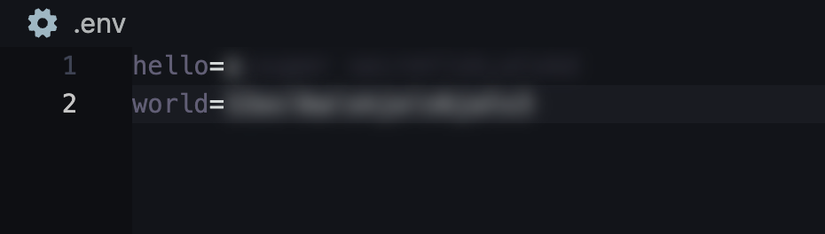
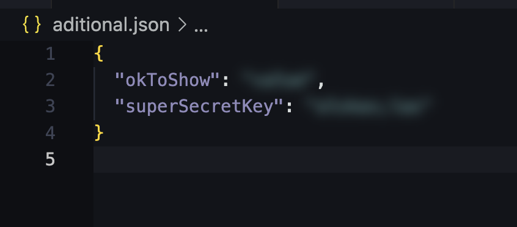
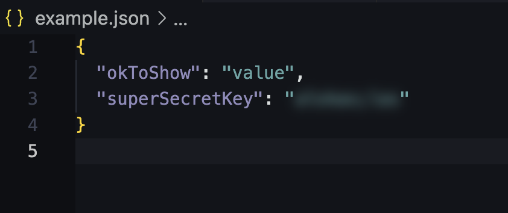
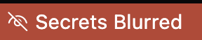

# Env Shield

A Visual Studio Code extension that automatically blurs secret values in `.env` files and other configurable files to prevent accidental exposure of sensitive information.

## Features

- Automatically detects and blurs sensitive information in .env files and other configured files
- Smart pattern recognition for common secret patterns
- Easy toggle functionality
- Customizable file patterns
- Real-time updates as you edit files
- Minimal performance impact
  

## Installation

From VS Code:

1. Open VS Code
2. Press `Ctrl+P` / `Cmd+P`
3. Type `ext install env-shield`
4. Press Enter

From Extensions Marketplace

1. Open VS Code
2. Access the Extensions Marketplace
3. Search for `Env Shield`
4. Click Install

   [insert image of extension in VS Code marketplace]

## Configuration

You can configure additional files to be processed through VS Code settings:

```json
{
  "env-shield.additionalFiles": [
    "config/secrets.json",
    "settings/credentials.json"
  ]
}
```

### Available Settings:

- `additionalFiles`: Array of additional JSON files to monitor
- `sensitiveFiles`: Array of files to check for sensitive patterns

## Usage

- The extension automatically activates for `.env` files and configured JSON files
- Click the "Secrets Blurred" status bar item to toggle blur effect
- Use the command "Toggle Sensitive Values Blur" from the command palette


## Extension in action

This section demonstrates the expected behavior of the extension with the specified settings:

```json
// settings.json
{
  "env-shield.additionalFiles": ["additional.json"],
  "env-shield.sensitiveFiles": ["example.json"]
}
```

### `.env` Files

The extension will automatically blur sensitive information in `.env` files:


### Configured Additional `.json` Files

The extension will also blur sensitive information in the specified additional JSON files:



### Configured Sensitive Files

Sensitive information in the configured sensitive files will be blurred as well:



### Status Bar Indicator

The status bar indicator shows the blur status and allows you to toggle the blur effect:

- Blurred Status: 
- Visible Status: 

```json
// settings.json
{
  "env-shield.additionalFiles": ["aditional.json"],
  "env-shield.sensitiveFiles": ["example.json"]
}
```

`.env` files:


Configured aditional `.json` files:


Configured sensitive files:


### Status bar indicator


## Tips and Tricks

- Use the status bar indicator to quickly check blur status
- Configure additional file patterns for custom use cases
  [insert image of status bar indicator]

## Development

### Prerequisites

- Node.js
- Visual Studio Code

### Setup

1. Clone the repository
2. Run `npm install`
3. Open in VS Code
4. Press F5 to start debugging

## License

[MIT](./LICENSE)

## Support

File issues at [GitHub Issues](https://github.com/csuriel/env-shield/issues)
